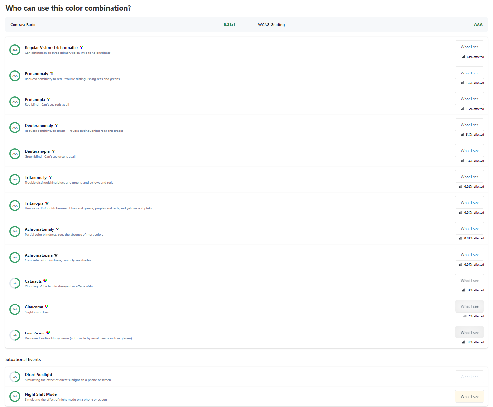

# Tic tac toe

## A React and Electron app

To improve the accessibility on the page I used the tool [Who can use](https://www.whocanuse.com/) to check the color combination. A tool that can show how color contrast can affect different people with visual impairments.
After some changes of my original choice of colors it resulted in this:

I also used the tool [Lighthouse](https://developer.chrome.com/docs/lighthouse) to get a report of the accessibility on the page, which reminded me to add an aria-label to the square button component.

## Available Scripts

To run both the React app and the Electron app in development mode, run:

### `npm run dev`

Reload the Electron app for the game to show
